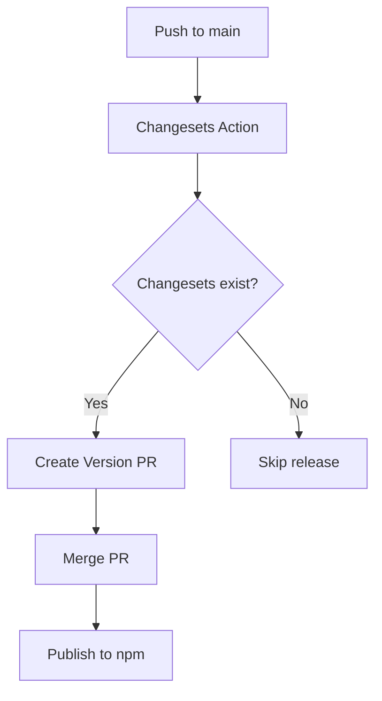

# Publishing Guide

This guide explains how to publish packages from this monorepo to npm.

## Prerequisites

1. **npm account**: You need an npm account with 2FA enabled
2. **Organization membership**: Your npm account must be a member of the `@opensourceframework` organization
3. **NPM_TOKEN secret**: Must be configured in GitHub repository secrets

## Setting Up NPM_TOKEN

### Step 1: Create an npm Access Token

1. Log in to [npmjs.com](https://www.npmjs.com/)
2. Go to your profile picture > **Access Tokens**
3. Click **Generate New Token** > **Classic Token**
4. Select **Automation** token type (required for CI/CD)
5. Copy the token immediately (you won't be able to see it again)

### Step 2: Add NPM_TOKEN to GitHub Secrets

1. Go to the GitHub repository
2. Navigate to **Settings** > **Secrets and variables** > **Actions**
3. Click **New repository secret**
4. Name: `NPM_TOKEN`
5. Value: Paste your npm access token
6. Click **Add secret**

### Step 3: Verify the Token

The token should have the following permissions:
- Read and write access to all packages in the `@opensourceframework` scope
- 2FA must be enabled on your npm account (but bypassed for automation tokens)

## Publishing Process

This monorepo uses [Changesets](https://github.com/changesets/changesets) for versioning and publishing.

### Making Changes

1. **Make your changes** to any package(s)

2. **Create a changeset**:
   ```bash
   pnpm changeset
   ```
   
   This will prompt you to:
   - Select which packages changed
   - Choose the version bump type (major, minor, patch)
   - Write a description of the changes

3. **Commit the changeset** along with your changes

### Version Bump

When you're ready to release:

```bash
pnpm version-packages
```

This will:
- Update package versions based on changesets
- Update CHANGELOG.md files
- Delete used changesets

### Publishing

The release workflow automatically triggers when:
1. Changes are pushed to the `main` branch
2. The Changesets action creates a "Version Packages" PR
3. The PR is merged

#### Manual Publishing (Emergency Only)

For emergency releases, you can manually publish:

```bash
# Build all packages
pnpm build

# Publish to npm
pnpm release
```

For canary releases (pre-release versions):

```bash
pnpm release:canary
```

## Release Workflow

The automated release process:



## Package Naming Convention

All packages are published under the `@opensourceframework` scope:

- `@opensourceframework/critters`
- `@opensourceframework/next-csrf`
- `@opensourceframework/next-images`
- `@opensourceframework/next-circuit-breaker`
- `@opensourceframework/react-a11y-utils`
- `@opensourceframework/seeded-rng`
- `@opensourceframework/next-json-ld`

## Troubleshooting

### Authentication Errors

If you see `ENEEDAUTH` errors:
1. Verify `NPM_TOKEN` is set correctly in GitHub secrets
2. Check if the token has expired
3. Ensure the token has automation permissions

### Package Already Exists

If you see `EPUBLISHCONFLICT`:
- The version you're trying to publish already exists
- Run `pnpm version-packages` to bump the version

### Scope Permission Errors

If you see permission errors for `@opensourceframework`:
1. Verify your npm account is a member of the organization
2. Check with org admins for proper permissions

## Additional Resources

- [Changesets Documentation](https://github.com/changesets/changesets)
- [npm Publishing Guide](https://docs.npmjs.com/packages-and-modules/contributing-packages-to-the-registry)
- [GitHub Actions Secrets](https://docs.github.com/en/actions/security-guides/using-secrets-in-github-actions)