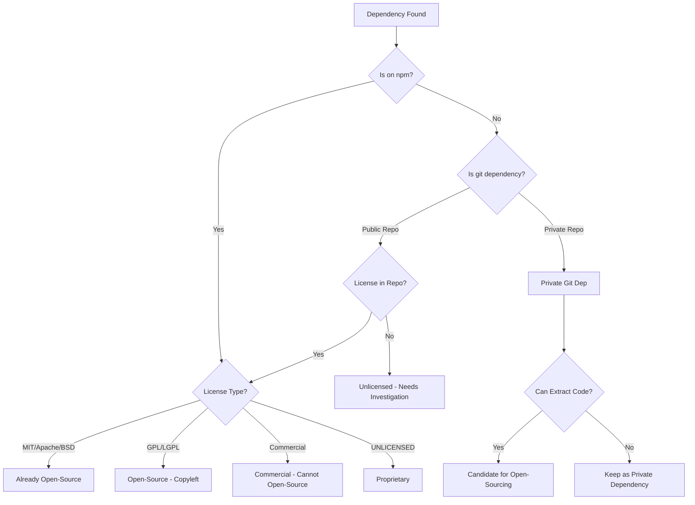
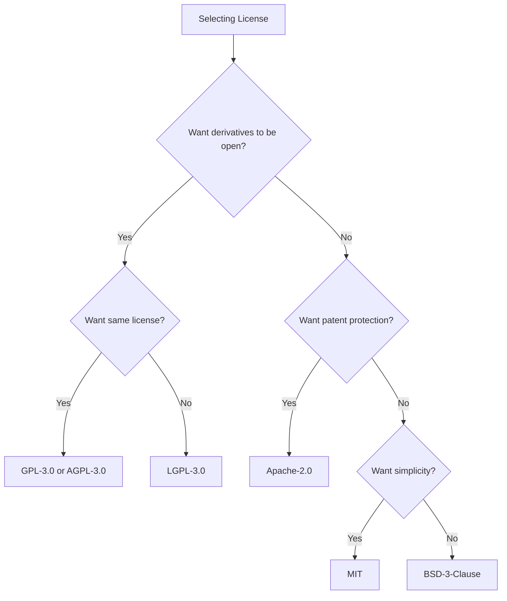
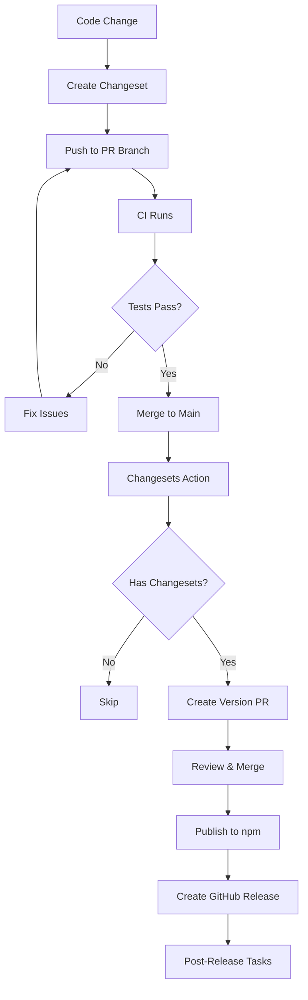
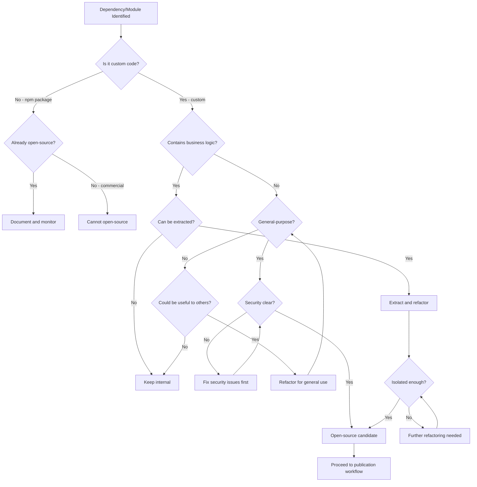
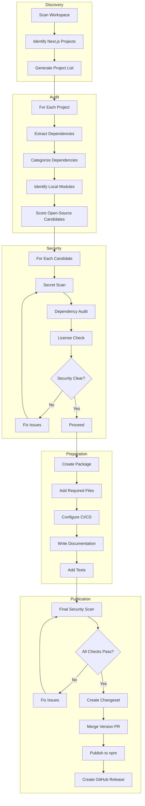
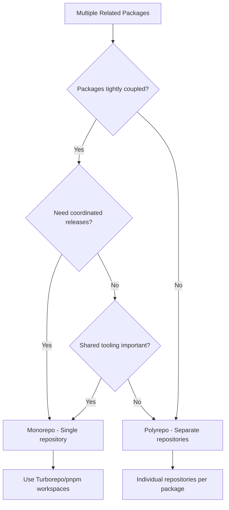
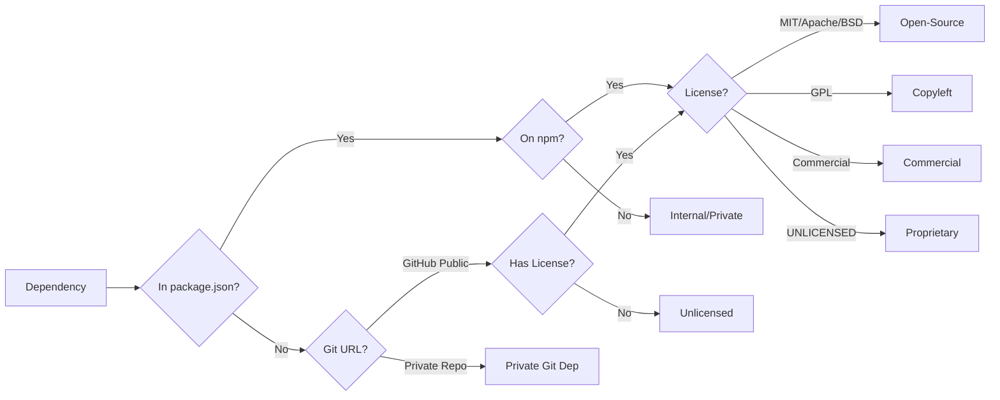

# Next.js Project Audit and Open-Sourcing Strategy

## Executive Summary

This document outlines a comprehensive strategy for auditing all Next.js projects in the development workspace and systematically open-sourcing custom internal dependencies and modules. The strategy covers discovery, audit, categorization, security review, and publication workflows.

---

## Table of Contents

1. [Discovery Phase](#1-discovery-phase)
2. [Audit Strategy](#2-audit-strategy)
3. [Categorization Framework](#3-categorization-framework)
4. [Open-Source Repository Standards](#4-open-source-repository-standards)
5. [Security Pre-Publication Audit](#5-security-pre-publication-audit)
6. [Decision Tree](#6-decision-tree)
7. [Tooling and Automation](#7-tooling-and-automation)
8. [Risk Mitigation](#8-risk-mitigation)
9. [Implementation Checklists](#9-implementation-checklists)
10. [Workflow Diagrams](#10-workflow-diagrams)

---

## 1. Discovery Phase

### 1.1 Project Discovery Strategy

#### Automated Discovery Script

Create a discovery script that scans the parent workspace directory for all Next.js projects:

```bash
#!/bin/bash
# discover-nextjs-projects.sh

WORKSPACE_DIR="/home/dario/Documents/dev workspace"
OUTPUT_FILE="discovered-projects.json"

# Find all package.json files containing Next.js dependency
find "$WORKSPACE_DIR" -name "package.json" -not -path "*/node_modules/*" -exec grep -l '"next"' {} \; | while read pkg; do
  PROJECT_DIR=$(dirname "$pkg")
  PROJECT_NAME=$(basename "$PROJECT_DIR")
  
  # Extract key information
  NEXT_VERSION=$(jq -r '.dependencies.next // .devDependencies.next // "not-found"' "$pkg")
  IS_PRIVATE=$(jq -r '.private // false' "$pkg")
  LICENSE=$(jq -r '.license // "UNLICENSED"' "$pkg")
  
  echo "{\"name\": \"$PROJECT_NAME\", \"path\": \"$PROJECT_DIR\", \"nextVersion\": \"$NEXT_VERSION\", \"private\": $IS_PRIVATE, \"license\": \"$LICENSE\"}"
done | jq -s '.' > "$OUTPUT_FILE"
```

#### Manual Discovery Checklist

- [ ] Scan all directories in `/home/dario/Documents/dev workspace/`
- [ ] Identify projects with `package.json` containing `"next"` dependency
- [ ] Check for monorepo structures (pnpm-workspace.yaml, lerna.json, turbo.json)
- [ ] Note projects using workspace packages (local dependencies)
- [ ] Document git remote URLs for each project

### 1.2 Current Workspace Analysis

Based on initial discovery, the following Next.js projects exist in the workspace:

| Project | Path | Next.js Version | Private | Uses OSF Packages |
|---------|------|-----------------|---------|-------------------|
| boeloe | `../boeloe/` | 16.1.6 | Yes | No |
| gabriel | `../gabriel/` | 16.1.1 | Yes | No |
| itsalive | `../itsalive/` | 14.2.35 | Unknown | No |
| voltage/Voltage-1 | `../voltage/Voltage-1/` | 16.1.4 | Yes | `next-csrf`, `critters` |
| portfolio/portfolio | `../portfolio/portfolio/` | 16.0.10 | Unknown | No |
| tarkuv | `../tarkuv/` | 16.1.6 | Yes | No |
| slotenmaker-master | `../slotenmaker-master/` | 16.1.6 | Yes | `next-images`, `critters` |
| jamal | `../jamal/` | 16.0.10 | Unknown | No |

### 1.3 Existing Open-Source Framework Packages

The current `opensourceframework` project already contains:

| Package | Path | Purpose | npm Status |
|---------|------|---------|------------|
| `@opensourceframework/critters` | `packages/critters/` | CSS optimization | Ready for publish |
| `@opensourceframework/next-csrf` | `packages/next-csrf/` | CSRF protection | Ready for publish |
| `@opensourceframework/next-images` | `packages/next-images/` | Image handling | Ready for publish |

---

## 2. Audit Strategy

### 2.1 Dependency Audit

#### 2.1.1 npm Dependencies Audit

For each discovered project, extract and categorize all npm dependencies:

```javascript
// audit-dependencies.js
const fs = require('fs');
const path = require('path');

function auditPackageJson(packageJsonPath) {
  const pkg = JSON.parse(fs.readFileSync(packageJsonPath, 'utf8'));
  
  const dependencies = {
    production: Object.entries(pkg.dependencies || {}),
    development: Object.entries(pkg.devDependencies || {}),
    peer: Object.entries(pkg.peerDependencies || {}),
    optional: Object.entries(pkg.optionalDependencies || {}),
  };
  
  // Categorize each dependency
  const categorized = {
    public: [],      // Already on npm with permissive license
    commercial: [],  // Commercial/proprietary licenses
    internal: [],    // Internal/workspace packages
    git: [],         // Git URL dependencies
    unknown: [],     // Cannot determine
  };
  
  // ... categorization logic
  
  return { dependencies, categorized };
}
```

#### 2.1.2 Git Dependencies Audit

Special attention to dependencies installed from git URLs:

```json
{
  "dependencies": {
    "some-package": "github:user/repo#branch",
    "another-package": "git+https://git.example.com/package.git"
  }
}
```

**Audit Steps:**
- [ ] Identify all git://, github:, git+https:// dependencies
- [ ] Check if git repository is public or private
- [ ] Determine if the git dependency is a fork of a public package
- [ ] Evaluate if the git dependency contains open-sourceable code

#### 2.1.3 Workspace/Local Package Audit

Identify internal workspace packages:

```yaml
# pnpm-workspace.yaml
packages:
  - 'packages/*'
  - 'libs/*'
```

**Audit Steps:**
- [ ] Parse workspace configuration files
- [ ] List all local packages
- [ ] Analyze each local package for open-source potential
- [ ] Document inter-package dependencies

### 2.2 Import Analysis

#### 2.2.1 Internal Import Scanner

Scan source files for internal imports that could be extracted:

```bash
# Find all internal imports (relative paths starting with @/ or ~/)
grep -r "from ['\"]@/" --include="*.ts" --include="*.tsx" --include="*.js" --include="*.jsx" projects/

# Find all imports from local workspace packages
grep -r "from ['\"]@opensourceframework" --include="*.ts" --include="*.tsx" projects/
```

#### 2.2.2 Custom Module Identification

Identify reusable custom modules:

```javascript
// scan-custom-modules.js
const fs = require('fs');
const path = require('path');

function scanForModules(projectDir) {
  const modules = [];
  
  // Common locations for reusable code
  const scanDirs = [
    'lib/', 'utils/', 'helpers/', 'services/', 
    'components/', 'hooks/', 'middleware/', 'modules/'
  ];
  
  for (const dir of scanDirs) {
    const fullPath = path.join(projectDir, dir);
    if (fs.existsSync(fullPath)) {
      // Analyze each file for export patterns
      // Identify self-contained, reusable modules
    }
  }
  
  return modules;
}
```

### 2.3 Audit Output Format

Generate standardized audit report:

```json
{
  "projectName": "voltage",
  "path": "../voltage/Voltage-1",
  "auditDate": "2026-02-15",
  "dependencies": {
    "total": 45,
    "production": 28,
    "development": 17
  },
  "categorization": {
    "alreadyOpenSource": [
      {"name": "next", "version": "16.1.4", "license": "MIT"},
      {"name": "react", "version": "19.2.1", "license": "MIT"}
    ],
    "commercial": [],
    "internalCandidates": [
      {"name": "custom-auth", "type": "local-module", "path": "lib/auth/"},
      {"name": "api-helpers", "type": "local-module", "path": "lib/api/"}
    ],
    "gitDependencies": [
      {"name": "some-fork", "url": "github:user/repo", "isPrivate": false}
    ]
  },
  "securityFindings": [],
  "recommendations": []
}
```

---

## 3. Categorization Framework

### 3.1 Dependency Categories



### 3.2 Category Definitions

| Category | Definition | Action |
|----------|------------|--------|
| **Already Open-Source** | Published on npm with permissive license (MIT, Apache-2.0, BSD) | Document and monitor for updates |
| **Open-Source Copyleft** | Published with GPL, LGPL, AGPL | Document, ensure compliance, consider implications |
| **Commercial** | Requires paid license | Cannot open-source, document license terms |
| **Proprietary** | UNLICENSED or custom license | Review legal before any action |
| **Private Git Dependency** | Dependency from private git repository | Evaluate for open-sourcing |
| **Internal Module** | Local code within project | Primary candidate for extraction |
| **Workspace Package** | Local monorepo package | Evaluate for open-sourcing |

### 3.3 Open-Source Candidate Criteria

A dependency/module is a **good candidate** for open-sourcing if:

- [ ] **Self-contained**: Functions independently without tight coupling to business logic
- [ ] **General-purpose**: Solves a common problem applicable to other projects
- [ ] **Well-structured**: Reasonable code organization and naming
- [ ] **No secrets**: Contains no API keys, credentials, or sensitive configuration
- [ ] **No proprietary logic**: Does not contain competitive business logic
- [ ] **Testable**: Has or can have automated tests
- [ ] **Documentable**: Can be documented for public use
- [ ] **License-compatible**: Any dependencies have compatible licenses

### 3.4 Scoring Matrix

Rate each candidate on a scale of 1-5 for each criterion:

| Criterion | Weight | Score (1-5) | Weighted Score |
|-----------|--------|-------------|----------------|
| Self-contained | 3 | _ | _ |
| General-purpose | 4 | _ | _ |
| No secrets/proprietary | 5 | _ | _ |
| Code quality | 2 | _ | _ |
| Test coverage | 2 | _ | _ |
| Documentation potential | 1 | _ | _ |
| **Total** | **17** | | **/85** |

**Recommendation Thresholds:**
- **70+**: Strong candidate - prioritize for open-sourcing
- **50-69**: Good candidate - consider for open-sourcing
- **30-49**: Weak candidate - needs refactoring first
- **<30**: Not recommended - keep internal

---

## 4. Open-Source Repository Standards

### 4.1 Required Files

Every open-source repository must include:

```
repository/
|-- LICENSE                 # Required - OSI-approved license
|-- README.md              # Required - Project documentation
|-- CHANGELOG.md           # Required - Version history
|-- CONTRIBUTING.md        # Required - Contribution guidelines
|-- CODE_OF_CONDUCT.md     # Required - Community standards
|-- SECURITY.md            # Required - Security policy
|-- package.json           # Required - Package metadata
|-- .gitignore             # Required - Git exclusions
|-- .npmignore             # Optional - npm exclusions
|-- .github/
|   |-- ISSUE_TEMPLATE/
|   |   |-- bug_report.yml
|   |   |-- feature_request.yml
|   |   |-- config.yml
|   |-- PULL_REQUEST_TEMPLATE.md
|   |-- workflows/
|   |   |-- ci.yml
|   |   |-- release.yml
|   |   |-- codeql-analysis.yml
|   |-- FUNDING.yml
|   |-- dependabot.yml
|-- src/                   # Source code
|-- test/                  # Test files
|-- docs/                  # Additional documentation
```

### 4.2 License Selection Guide

#### Decision Matrix



#### License Comparison

| License | Copyleft | Patent Grant | Simplicity | Commercial Use | Recommended For |
|---------|----------|--------------|------------|----------------|-----------------|
| MIT | No | No | High | Yes | Most packages |
| Apache-2.0 | No | Yes | Medium | Yes | Larger projects, enterprise |
| BSD-3-Clause | No | No | Medium | Yes | Similar to MIT |
| GPL-3.0 | Yes | Yes | Low | Conditional | Core libraries wanting contributions back |
| AGPL-3.0 | Strong | Yes | Low | Conditional | Network services |
| LGPL-3.0 | Weak | Yes | Low | Yes | Libraries allowing proprietary linking |

**Default Recommendation:** MIT for most packages, Apache-2.0 for packages with patent-sensitive code.

### 4.3 Documentation Requirements

#### README.md Structure

```markdown
# @scope/package-name

> Brief one-line description

[![npm version][npm-badge]][npm-url]
[![License][license-badge]][license-url]
[![Build Status][build-badge]][build-url]

## Installation

npm install @scope/package-name

## Quick Start

// Minimal working example

## API Reference

### Main Function

Description and parameters

## Examples

Links to example projects

## Contributing

See CONTRIBUTING.md

## License

MIT - See LICENSE
```

#### API Documentation Standards

- **TSDoc/JSDoc**: All public exports must have documentation comments
- **Type definitions**: TypeScript `.d.ts` files for all public APIs
- **Examples**: Inline code examples in documentation
- **Playground**: Link to CodeSandbox/StackBlitz demo if applicable

### 4.4 Community Files

#### CONTRIBUTING.md Requirements

1. **Development Setup**: How to fork, clone, and run locally
2. **Code Standards**: Linting, formatting, and style guidelines
3. **Commit Convention**: Conventional commits specification
4. **PR Process**: Branch naming, PR size limits, review process
5. **Testing Requirements**: Minimum coverage, test types required

#### CODE_OF_CONDUCT.md

Recommended: [Contributor Covenant 2.1](https://www.contributor-covenant.org/version/2/1/code_of_conduct/)

#### SECURITY.md Requirements

1. **Supported Versions**: Table of maintained versions
2. **Reporting Process**: How to report vulnerabilities privately
3. **Response Timeline**: Expected response times by severity
4. **Disclosure Policy**: Coordinated disclosure approach

### 4.5 CI/CD Setup

#### Required Workflows

**CI Workflow (ci.yml):**
- Linting
- Type checking
- Unit tests
- Integration tests (if applicable)
- Build verification
- Security audit

**Release Workflow (release.yml):**
- Version bumping (via changesets)
- Changelog generation
- npm publishing
- GitHub release creation

**Security Workflow (codeql-analysis.yml):**
- CodeQL scanning
- Dependency vulnerability scanning
- Secret scanning (GitHub native)

### 4.6 Versioning Strategy

#### Semantic Versioning

Follow [SemVer 2.0.0](https://semver.org/):

- **MAJOR**: Breaking changes
- **MINOR**: New features, backwards compatible
- **PATCH**: Bug fixes, backwards compatible

#### Changeset Configuration

```json
{
  "$schema": "https://unpkg.com/@changesets/config@3.0.0/schema.json",
  "changelog": "@changesets/cli/changelog",
  "commit": false,
  "fixed": [],
  "linked": [],
  "access": "public",
  "baseBranch": "main",
  "updateInternalDependencies": "patch",
  "ignore": []
}
```

### 4.7 Publishing Workflow



---

## 5. Security Pre-Publication Audit

### 5.1 Security Checklist

Before making any repository public, complete this security audit:

#### Code Scanning

- [ ] Run `git secrets --scan` on entire repository history
- [ ] Run `truffleHog` or `gitleaks` for secret detection
- [ ] Search for hardcoded credentials:
  ```bash
  grep -rE "(password|api_key|secret|token|credential)" --include="*.ts" --include="*.js" --include="*.env*"
  ```
- [ ] Check for accidentally committed `.env` files
- [ ] Remove any `.env.example` values that look like real credentials

#### Dependency Security

- [ ] Run `npm audit` / `pnpm audit` and resolve all vulnerabilities
- [ ] Run `npm outdated` and update outdated dependencies
- [ ] Check for deprecated packages
- [ ] Verify all dependencies have licenses compatible with your chosen license

#### Access Control

- [ ] Review GitHub repository access permissions
- [ ] Ensure no private CI/CD variables are exposed in code
- [ ] Check that npm token is set as repository secret, not in code
- [ ] Verify branch protection rules are enabled

### 5.2 Secret Detection Tools

#### Recommended Tools

| Tool | Purpose | Integration |
|------|---------|-------------|
| `git-secrets` | Pre-commit hook for secret detection | Local development |
| `truffleHog` | Scan git history for secrets | CI pipeline |
| `gitleaks` | Fast secret scanner | CI pipeline |
| `CodeQL` | Semantic code analysis | GitHub Actions |
| `Snyk` | Dependency vulnerability scanning | CI pipeline |
| `npm audit` | Package vulnerability check | CI pipeline |

#### Pre-Publication Scan Script

```bash
#!/bin/bash
# pre-publish-security-scan.sh

set -e

echo "Running security scans..."

# 1. Secret scanning
echo "Checking for secrets..."
gitleaks detect --source . --verbose

# 2. Dependency audit
echo "Auditing dependencies..."
pnpm audit --audit-level=moderate

# 3. License check
echo "Checking license compatibility..."
license-checker --summary --excludePrivatePackages

# 4. Sensitive file check
echo "Checking for sensitive files..."
if find . -name ".env*" -not -path "./node_modules/*" | grep -q .; then
  echo "WARNING: .env files found. Ensure they are in .gitignore"
fi

echo "Security scan complete."
```

### 5.3 License Compatibility Matrix

When open-sourcing, ensure your dependencies don't conflict:

| Your License | Can Use MIT | Can Use Apache | Can Use GPL | Can Use LGPL |
|--------------|-------------|----------------|-------------|--------------|
| MIT | Yes | Yes | Yes | Yes |
| Apache-2.0 | Yes | Yes | Yes | Yes |
| GPL-3.0 | Yes | Yes | Yes | Yes |
| LGPL-3.0 | Yes | Yes | Yes | Yes |

**Important:** If your package includes GPL-licensed code, your package must also be GPL!

---

## 6. Decision Tree

### 6.1 Open-Source Decision Flow



### 6.2 Publication Readiness Checklist

Before publishing, verify:

#### Code Quality

- [ ] All code passes linting
- [ ] TypeScript compiles without errors
- [ ] All exports have TSDoc comments
- [ ] No `any` types without justification
- [ ] No console.log statements in production code

#### Testing

- [ ] Unit tests exist for core functionality
- [ ] Test coverage meets minimum threshold (recommended: 80%)
- [ ] Integration tests for critical paths
- [ ] All tests pass

#### Documentation

- [ ] README.md complete with installation and usage
- [ ] API documentation generated
- [ ] Examples provided
- [ ] Migration guide if migrating from another package

#### Package Configuration

- [ ] `package.json` has correct metadata:
  - [ ] Unique name (check npm availability)
  - [ ] Correct scope (`@opensourceframework/`)
  - [ ] Description
  - [ ] Keywords
  - [ ] Author/maintainers
  - [ ] License
  - [ ] Repository URL
  - [ ] Exports field for ESM/CJS
  - [ ] Types field for TypeScript

#### Security

- [ ] No secrets in code or history
- [ ] Dependencies audited
- [ ] License compatibility verified

#### Legal

- [ ] If forked, original license preserved/attributed
- [ ] Contributor license agreement if applicable
- [ ] Not violating any NDAs or employment agreements

---

## 7. Tooling and Automation

### 7.1 Recommended Tool Stack

| Purpose | Tool | Configuration |
|---------|------|---------------|
| Package Manager | pnpm | `pnpm-workspace.yaml` |
| Build System | Turborepo | `turbo.json` |
| Bundler | tsup | `tsup.config.ts` |
| Testing | Vitest | `vitest.config.ts` |
| Linting | ESLint | `eslint.config.js` |
| Formatting | Prettier | `.prettierrc` |
| Versioning | Changesets | `.changeset/config.json` |
| Commit Linting | Commitlint | `.commitlintrc.json` |
| Git Hooks | Husky | `.husky/` |
| Secret Detection | gitleaks | `.gitleaks.toml` |
| License Check | license-checker | npm script |
| Security Audit | npm audit / Snyk | CI pipeline |

### 7.2 Automation Scripts

#### Discovery Automation

```javascript
// scripts/discover-projects.mjs
import { glob } from 'glob';
import { readFileSync } from 'fs';

async function discoverProjects(workspaceDir) {
  const packageFiles = await glob('**/package.json', {
    cwd: workspaceDir,
    ignore: ['**/node_modules/**'],
  });

  const projects = [];

  for (const file of packageFiles) {
    const content = JSON.parse(readFileSync(file, 'utf8'));
    if (content.dependencies?.next || content.devDependencies?.next) {
      projects.push({
        name: content.name,
        path: file.replace('/package.json', ''),
        nextVersion: content.dependencies?.next || content.devDependencies?.next,
        private: content.private ?? false,
        dependencies: Object.keys(content.dependencies || {}),
        devDependencies: Object.keys(content.devDependencies || {}),
      });
    }
  }

  return projects;
}
```

#### Audit Automation

```javascript
// scripts/audit-project.mjs
import { execSync } from 'child_process';

function auditProject(projectPath) {
  const results = {
    vulnerabilities: [],
    outdated: [],
    licenses: [],
  };

  // npm audit
  try {
    const auditOutput = execSync('npm audit --json', { cwd: projectPath, encoding: 'utf8' });
    results.vulnerabilities = JSON.parse(auditOutput).vulnerabilities || [];
  } catch (error) {
    // npm audit exits with non-zero if vulnerabilities found
    results.vulnerabilities = JSON.parse(error.stdout).vulnerabilities || [];
  }

  // npm outdated
  try {
    const outdatedOutput = execSync('npm outdated --json', { cwd: projectPath, encoding: 'utf8' });
    results.outdated = JSON.parse(outdatedOutput) || {};
  } catch (error) {
    results.outdated = JSON.parse(error.stdout) || {};
  }

  // License check
  try {
    const licenseOutput = execSync('npx license-checker --json', { cwd: projectPath, encoding: 'utf8' });
    results.licenses = JSON.parse(licenseOutput);
  } catch (error) {
    results.licenses = {};
  }

  return results;
}
```

#### Security Pre-Scan

```javascript
// scripts/security-prescan.mjs
import { execSync } from 'child_process';

function securityScan(repoPath) {
  const issues = [];

  // Git-secrets check
  try {
    execSync('git secrets --scan', { cwd: repoPath });
  } catch (error) {
    issues.push({ type: 'secret', tool: 'git-secrets', details: error.message });
  }

  // Gitleaks
  try {
    execSync('gitleaks detect --source . --no-git', { cwd: repoPath });
  } catch (error) {
    issues.push({ type: 'secret', tool: 'gitleaks', details: error.message });
  }

  // Check for .env files
  const envFiles = execSync('find . -name ".env*" -not -path "./node_modules/*"', {
    cwd: repoPath,
    encoding: 'utf8'
  }).trim();
  
  if (envFiles) {
    issues.push({ type: 'config', tool: 'manual', details: `Found env files: ${envFiles}` });
  }

  return issues;
}
```

### 7.3 CI Pipeline Template

```yaml
# .github/workflows/pre-publish.yml
name: Pre-Publication Checks

on:
  push:
    branches: [main]
  pull_request:
    branches: [main]

jobs:
  security:
    runs-on: ubuntu-latest
    steps:
      - uses: actions/checkout@v4
        with:
          fetch-depth: 0  # Full history for secret scanning
      
      - name: Run Gitleaks
        uses: gitleaks/gitleaks-action@v2
        env:
          GITHUB_TOKEN: ${{ secrets.GITHUB_TOKEN }}
      
      - name: Run npm audit
        run: npm audit --audit-level=moderate
      
      - name: Check licenses
        run: npx license-checker --summary --excludePrivatePackages

  quality:
    runs-on: ubuntu-latest
    steps:
      - uses: actions/checkout@v4
      
      - uses: pnpm/action-setup@v3
        with:
          version: 9
      
      - uses: actions/setup-node@v4
        with:
          node-version: '20'
          cache: 'pnpm'
      
      - run: pnpm install --frozen-lockfile
      
      - name: Lint
        run: pnpm lint
      
      - name: Type Check
        run: pnpm typecheck
      
      - name: Test
        run: pnpm test:coverage
      
      - name: Build
        run: pnpm build
```

---

## 8. Risk Mitigation

### 8.1 Identified Risks

| Risk | Impact | Likelihood | Mitigation |
|------|--------|------------|------------|
| **Accidental secret exposure** | Critical | Medium | Automated secret scanning, pre-commit hooks |
| **License incompatibility** | High | Medium | License compatibility matrix, legal review |
| **Breaking existing users** | High | Low | Semantic versioning, deprecation notices |
| **Package name squatting** | Medium | Low | Reserve names early, use scoped packages |
| **Security vulnerabilities** | Critical | Medium | Regular audits, automated scanning |
| **Code quality issues** | Medium | Medium | Required code review, linting, testing |
| **Documentation gaps** | Medium | High | Documentation templates, required sections |
| **Maintenance burden** | Medium | High | Clear contribution guidelines, sustainable scope |
| **Intellectual property issues** | High | Low | Legal review, employment agreement check |

### 8.2 Mitigation Strategies

#### Secret Exposure Prevention

1. **Pre-commit hooks**: Use `husky` + `git-secrets`
2. **CI scanning**: Run `gitleaks` on every push
3. **History scanning**: Scan before making private repos public
4. **Environment variables**: Use `.env.example` with placeholder values

#### License Compliance

1. **License header**: Add license header to all source files
2. **Dependency check**: Run `license-checker` before publication
3. **GPL check**: Flag any GPL dependencies for review
4. **Fork attribution**: Preserve original license and attribution

#### Backwards Compatibility

1. **Semantic versioning**: Strict adherence to SemVer
2. **Deprecation warnings**: Use `@deprecated` JSDoc tags
3. **Migration guides**: Document breaking changes
4. **Release candidates**: Use prerelease versions for major changes

---

## 9. Implementation Checklists

### 9.1 Phase 1: Discovery Checklist

- [ ] Run discovery script on parent workspace
- [ ] Generate list of all Next.js projects
- [ ] Identify monorepo structures
- [ ] Document project ownership/purpose
- [ ] Create initial project inventory spreadsheet

### 9.2 Phase 2: Audit Checklist

For each discovered project:

- [ ] Extract all dependencies from `package.json`
- [ ] Categorize each dependency
- [ ] Identify git dependencies
- [ ] Identify workspace/local packages
- [ ] Scan for internal imports
- [ ] Identify reusable modules
- [ ] Score candidates for open-sourcing
- [ ] Generate audit report

### 9.3 Phase 3: Security Review Checklist

For each open-source candidate:

- [ ] Run secret detection scan
- [ ] Run dependency vulnerability audit
- [ ] Check license compatibility
- [ ] Review for proprietary logic
- [ ] Verify no employment agreement conflicts
- [ ] Document any required refactoring

### 9.4 Phase 4: Preparation Checklist

- [ ] Create package structure (use template)
- [ ] Add all required files (LICENSE, README, etc.)
- [ ] Configure CI/CD workflows
- [ ] Set up changesets
- [ ] Write/migrate tests
- [ ] Write documentation
- [ ] Create examples
- [ ] Set up npm publishing

### 9.5 Phase 5: Publication Checklist

- [ ] Verify all Phase 4 items complete
- [ ] Run full security scan
- [ ] Verify package name availability on npm
- [ ] Create changeset for initial release
- [ ] Merge version PR
- [ ] Verify npm publication successful
- [ ] Create GitHub release
- [ ] Announce release

---

## 10. Workflow Diagrams

### 10.1 Complete Audit-to-Publish Workflow



### 10.2 Monorepo vs Polyrepo Decision



### 10.3 Dependency Categorization Workflow



---

## Appendix A: Template Files

### A.1 Package README Template

```markdown
# @opensourceframework/package-name

> Brief description of what this package does

[](https://www.npmjs.com/package/@opensourceframework/package-name)
[](https://www.npmjs.com/package/@opensourceframework/package-name)
[](./LICENSE)

## Installation

```bash
npm install @opensourceframework/package-name
# or
pnpm add @opensourceframework/package-name
# or
yarn add @opensourceframework/package-name
```

## Quick Start

```typescript
import { something } from '@opensourceframework/package-name';

// Example usage
const result = something(options);
```

## API Reference

### `functionName(param1, param2)`

Description of what the function does.

**Parameters:**
- `param1` (Type): Description
- `param2` (Type, optional): Description

**Returns:** Type - Description

**Example:**
```typescript
const result = functionName('value', { option: true });
```

## Examples

- [Basic Example](./examples/basic/)
- [Advanced Example](./examples/advanced/)

## Contributing

See [CONTRIBUTING.md](./CONTRIBUTING.md) for guidelines.

## Changelog

See [CHANGELOG.md](./CHANGELOG.md) for version history.

## License

[MIT](./LICENSE) © OpenSource Framework Contributors
```

### A.2 CONTRIBUTING.md Template

```markdown
# Contributing to @opensourceframework/package-name

Thank you for your interest in contributing!

## Development Setup

1. Fork and clone the repository
2. Install dependencies: `pnpm install`
3. Run tests: `pnpm test`
4. Start development: `pnpm dev`

## Code Standards

- All code must pass ESLint: `pnpm lint`
- All code must pass TypeScript: `pnpm typecheck`
- All code must have tests: `pnpm test`

## Commit Convention

We follow [Conventional Commits](https://www.conventionalcommits.org/):

- `feat:` New features
- `fix:` Bug fixes
- `docs:` Documentation changes
- `test:` Test changes
- `refactor:` Code refactoring
- `chore:` Maintenance tasks

## Pull Request Process

1. Create a feature branch from `main`
2. Make your changes
3. Add/update tests
4. Update documentation
5. Create a changeset: `pnpm changeset`
6. Submit PR

## Code of Conduct

See [CODE_OF_CONDUCT.md](./CODE_OF_CONDUCT.md).
```

---

## Appendix B: Quick Reference Commands

### Discovery Commands

```bash
# Find all Next.js projects
find . -name "package.json" -not -path "*/node_modules/*" -exec grep -l '"next"' {} \;

# List all dependencies across projects
find . -name "package.json" -not -path "*/node_modules/*" -exec jq -r '.dependencies | keys[]' {} \; | sort | uniq -c | sort -rn
```

### Security Commands

```bash
# Secret scanning
gitleaks detect --source . --verbose

# Dependency audit
npm audit --audit-level=moderate

# License check
npx license-checker --summary

# Outdated packages
npm outdated
```

### Publication Commands

```bash
# Create changeset
pnpm changeset

# Version packages
pnpm version-packages

# Publish
pnpm release

# Dry run
pnpm build && npm pack --dry-run
```

---

## Document History

| Version | Date | Author | Changes |
|---------|------|--------|---------|
| 1.0 | 2026-02-15 | Architecture Team | Initial comprehensive strategy |
| 1.1 | 2026-02-15 | Architecture Team | Added evaluation results from audit |

---

## Evaluation Results

### Summary

The audit and evaluation of 6 Next.js projects in the development workspace has been completed. Below are the key findings from the dependency categorization and internal module evaluation.

### Dependency Categorization Results

| Category | Count | Percentage |
|----------|-------|------------|
| Already Open-Source | 124 | 98.4% |
| Copyleft (MPL-2.0) | 1 | 0.8% |
| Commercial | 1 | 0.8% |
| Private Git Dependencies | 0 | 0% |
| **Total** | **126** | **100%** |

#### Key Findings

1. **Excellent Open-Source Compatibility**: 98.4% of dependencies are already open-source with permissive licenses (MIT, Apache-2.0, ISC, BSD). This means no license conflicts for open-sourcing internal modules.

2. **Copyleft Package**: `axe-core` (MPL-2.0) is only used as a dev dependency for accessibility testing. It does not affect production builds and poses no risk to open-sourcing.

3. **Commercial Package**: `gsap` (GreenSock Standard License) is used in the gabriel project. While not OSI-approved, it's free for most uses. The commercial license only applies to certain commercial scenarios. This should be documented if extracting the canvas3D components.

4. **No Private Git Dependencies**: All projects use npm packages directly with no git:// or private repository dependencies.

### Internal Module Evaluation Results

Nine internal modules were identified as candidates for open-sourcing and evaluated using the weighted scoring matrix:

| Module | Source Project | Score | Recommendation |
|--------|---------------|-------|----------------|
| circuitBreaker | slotenmaker-master | 87 | **Strong** |
| accessibility | slotenmaker-master | 82 | **Strong** |
| rng | tarkuv | 79 | **Strong** |
| structuredData | slotenmaker-master | 73 | **Strong** |
| canvas3D | gabriel | 64 | Good |
| gameComponents | tarkuv | 59 | Good |
| gameEngine | tarkuv | 57 | Good |
| whatsapp | itsalive | 56 | Good |
| sleepAnalyzer | itsalive | 53 | Good |

### Recommended Extraction Phases

#### Phase 1: Quick Wins (1-2 weeks)

High-score, low-effort modules that are self-contained:

- **@opensourceframework/next-circuit-breaker** - Circuit Breaker pattern for API resilience
- **@opensourceframework/seeded-rng** - Deterministic random number generation
- **@opensourceframework/next-json-ld** - JSON-LD structured data for SEO

These modules have no or minimal dependencies and can be extracted quickly with minimal risk.

#### Phase 2: Medium Complexity (2-4 weeks)

Good candidates with some dependencies:

- **@opensourceframework/next-a11y-utils** - Accessibility utilities (React dependency)
- **@opensourceframework/react-three-portfolio** - 3D canvas components (Three.js dependencies)
- **@opensourceframework/sleep-analysis** - Sleep analysis utilities

#### Phase 3: Complex Packages (4-8 weeks)

Higher effort or maintenance burden:

- **@opensourceframework/turn-based-game-engine** - Complete game engine with multiple systems
- **@opensourceframework/turn-based-game-ui** - Game UI components
- **@opensourceframework/next-whatsapp** - WhatsApp integration (unofficial API risks)

### Monorepo vs Polyrepo Decision

**Decision: Continue with Monorepo**

All candidates are Next.js/React focused and share a common scope (`@opensourceframework`). The existing monorepo structure is recommended because:

1. **Unified Tooling**: Turborepo, changesets, and shared configurations already exist
2. **Consistent CI/CD**: Single workflow configuration for all packages
3. **Shared Standards**: Common linting, formatting, and testing setup
4. **Cross-package Testing**: Easier to test packages that depend on each other
5. **Small Package Size**: Total size is manageable in a single repository

A polyrepo approach would only make sense if:
- The game engine grows significantly in complexity
- Different maintainers/communities emerge for specific packages
- Independent versioning becomes a bottleneck

### Security Considerations

From the security audit ([`plans/security-flags.json`](plans/security-flags.json)):

1. **No blocking issues for open-sourcing** - All identified security flags are related to project-specific configuration (JWT secrets, env files) and not the extractable modules.

2. **Modules are security-safe** - None of the identified candidates contain hardcoded secrets or sensitive business logic.

3. **Recommended actions before publication**:
   - Run secret detection scan on extracted code
   - Verify no environment-specific values remain
   - Add security policy (SECURITY.md) to each package

### Next Steps

1. **Create extraction branches** for Phase 1 modules
2. **Set up package structure** using existing monorepo templates
3. **Write tests** for each extracted module (target: 80% coverage)
4. **Create documentation** (README, API docs, examples)
5. **Run security pre-scan** before each publication
6. **Publish to npm** under `@opensourceframework` scope

---

*This document should be reviewed and updated as the open-sourcing process progresses and new insights are gained.*