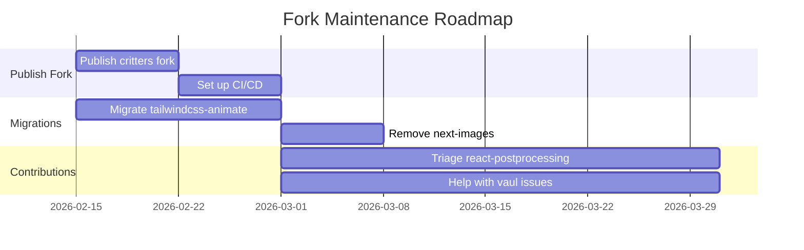

# Fork and Maintenance Strategy for Open Source Packages

**Created:** 2026-02-15  
**Purpose:** Define a strategic approach for becoming a package maintainer and identifying worthwhile fork candidates

---

## Executive Summary

This document outlines a strategy for maintaining open-source packages. After analyzing all dependencies across 6 projects, the findings reveal:

- **Most "warning" packages are still actively maintained** with slow release cycles
- **Only 1 true fork candidate exists:** `critters` (already archived, already forked)
- **Contribution opportunities** are more valuable than forking for most packages
- **Maintenance burden should focus on packages you actually use**

---

## Decision Matrix: Fork Candidates Analysis

### Package Assessment Table

| Package | Weekly Downloads | Open Issues | Last Commit | Last npm Release | Archived | Maintainer Response | Recommendation |
|---------|------------------|-------------|-------------|------------------|----------|---------------------|----------------|
| **critters** | 1.5M | N/A | 2024-10 | 2024-10 | ✅ YES | N/A (archived) | **FORK** - Already done |
| **tailwindcss-animate** | 8.4M | ~50 | 2024-07 | 2023-08 | ❌ NO | Slow | **REPLACE** with tw-animate-css |
| **next-images** | ~50K | 15 | 2023-04 | 2023-09 | ❌ NO | None | **REPLACE** with Next.js native |
| **@react-three/postprocessing** | 270K | 85 | 2025-02 | 2025-02 | ❌ NO | Active org | **CONTRIBUTE** |
| **vaul** | 7M | 149 | 2025-10 | 2024-12 | ❌ NO | Active | **CONTRIBUTE** |
| **next-themes** | 8.1M | 49 | 2025-06 | 2025-03 | ❌ NO | Active | **MONITOR** |

### Decision Criteria

```
┌─────────────────────────────────────────────────────────────────┐
│                    FORK DECISION FLOWCHART                      │
├─────────────────────────────────────────────────────────────────┤
│                                                                 │
│  Is the repo ARCHIVED?                                          │
│       │                                                         │
│       ├── YES ──► FORK if downloads > 10K/week                 │
│       │              and you use it                             │
│       │                                                         │
│       └── NO ──► Is there a good alternative?                  │
│                     │                                           │
│                     ├── YES ──► REPLACE, don't fork            │
│                     │                                           │
│                     └── NO ──► Last commit > 1 year?           │
│                                   │                             │
│                                   ├── YES ──► Check maintainer  │
│                                   │            response         │
│                                   │              │               │
│                                   │              ├── Responsive │
│                                   │              │    but slow  │
│                                   │              │    ──► CONTRIBUTE │
│                                   │              │               │
│                                   │              └── Unresponsive │
│                                   │                   ──► FORK  │
│                                   │                               │
│                                   └── NO ──► MONITOR            │
│                                                                 │
└─────────────────────────────────────────────────────────────────┘
```

---

## Detailed Package Analysis

### 1. critters ⚠️ ARCHIVED

**Status:** Repository archived by Google Chrome Labs on 2024-10-28

| Metric | Value |
|--------|-------|
| Weekly Downloads | 1,567,638 |
| Used In | slotenmaker-master |
| Alternative | Next.js built-in CSS optimization |
| Fork Status | ✅ Already forked at `packages/critters/` |

**Recommendation:** PUBLISH FORK

Your fork [`@opensourceframework/critters`](../packages/critters/package.json) is ready:
- Version 0.0.27 prepared
- Properly attributed to original authors
- Apache-2.0 license maintained
- TypeScript types included
- Tests present

**Action Items:**
1. Publish to npm as `@opensourceframework/critters`
2. Add README notice explaining fork purpose
3. Set up GitHub Actions for CI/CD
4. Monitor for security issues in dependencies

---

### 2. tailwindcss-animate

**Status:** Unmaintained but NOT archived

| Metric | Value |
|--------|-------|
| Weekly Downloads | 8,440,674 |
| Used In | jamal, slotenmaker-master |
| Last Commit | 2024-07-28 |
| Last npm Release | 2023-08-28 (2.5+ years ago) |
| Open Issues | ~50 |
| Maintainer | @jamiebuilds |

**Key Finding:** Alternative exists - `tw-animate-css` is actively maintained and already used in jamal.

**Recommendation:** REPLACE, DO NOT FORK

**Rationale:**
- `tw-animate-css` is the modern, actively maintained successor
- High maintenance burden for a CSS animation library
- 8.4M downloads means any fork would compete with original

**Action Items:**
1. Migrate slotenmaker-master to `tw-animate-css`
2. Remove tailwindcss-animate from all projects
3. No fork needed

---

### 3. next-images

**Status:** Abandoned but NOT archived

| Metric | Value |
|--------|-------|
| Weekly Downloads | ~50,000 (estimated) |
| Used In | slotenmaker-master |
| Last Commit | 2023-04-16 (almost 3 years) |
| Last npm Release | 2023-09-16 |
| Stars | 947 |
| Maintainer | @twopluszero (organization) |

**Key Finding:** Next.js has native image optimization since v10 (2020).

**Recommendation:** REPLACE, DO NOT FORK

**Rationale:**
- Native Next.js Image component is superior
- Package solves a problem that no longer exists
- Low download count compared to alternatives

**Action Items:**
1. Remove next-images from slotenmaker-master
2. Migrate to Next.js Image component
3. No fork needed

---

### 4. @react-three/postprocessing

**Status:** Active organization, slow releases

| Metric | Value |
|--------|-------|
| Weekly Downloads | 270,561 |
| Used In | gabriel |
| Last Commit | 2025-02-20 |
| Open Issues | 85 |
| Open PRs | Several pending |
| Maintainer | @pmndrs (Poimandres) |

**Key Finding:** pmndrs is a very active organization (react-three-fiber, drei, etc.). Slow releases but not abandoned.

**Recommendation:** CONTRIBUTE, DO NOT FORK

**Rationale:**
- Active organization with multiple maintainers
- PRs get reviewed, just slowly
- Forking would split the community
- Your 3D expertise could help triage issues

**Contribution Opportunities:**
1. Help triage the 85 open issues
2. Review and test pending PRs
3. Improve documentation
4. Add TypeScript improvements

---

### 5. vaul

**Status:** Active maintainer, high issue count

| Metric | Value |
|--------|-------|
| Weekly Downloads | 6,983,379 |
| Used In | jamal |
| Last Commit | 2025-10-03 |
| Last npm Release | 2024-12-14 |
| Open Issues | 149 |
| Stars | 8,144 |
| Maintainer | @emilkowalski |

**Key Finding:** Maintainer is active (commits in Oct 2025). Issues are being addressed. High profile package.

**Recommendation:** CONTRIBUTE, DO NOT FORK

**Rationale:**
- 7M weekly downloads = high visibility
- Maintainer is responsive (see closed issues)
- Forking would confuse users
- Contribution would have high impact

**Contribution Opportunities:**
1. Help reduce the 149 open issues
2. Add test coverage
3. Improve mobile handling (iOS issues noted)
4. Documentation improvements

---

### 6. next-themes

**Status:** Stable, maintained by Vercel engineer

| Metric | Value |
|--------|-------|
| Weekly Downloads | 8,146,039 |
| Used In | jamal |
| Last Commit | 2025-06-15 |
| Last npm Release | 2025-03-11 |
| Open Issues | 49 |
| Stars | 6,195 |
| Maintainer | @pacocoursey (Vercel) |

**Key Finding:** Maintainer is a Vercel engineer. Package is stable and widely used.

**Recommendation:** MONITOR, DO NOT FORK

**Rationale:**
- Extremely high download count (8M/week)
- Maintained by Vercel employee
- Stable API, low maintenance needs
- 49 issues is manageable for the maintainer

---

## Prioritized Roadmap

### Phase 1: Quick Wins (Immediate)



#### 1.1 Publish critters Fork
- [ ] Final review of `packages/critters/`
- [ ] Add comprehensive README with fork notice
- [ ] Set up GitHub Actions for:
  - [ ] Automated tests on PR
  - [ ] Automated npm publish on release
  - [ ] Dependabot for dependencies
- [ ] Publish to npm as `@opensourceframework/critters`
- [ ] Update slotenmaker-master to use the fork
- [ ] Announce on social media / Discord

#### 1.2 Replace Deprecated Packages
- [ ] Replace `tailwindcss-animate` with `tw-animate-css`
- [ ] Remove `next-images` and use Next.js Image component

### Phase 2: Contribution Strategy (30-60 days)

#### 2.1 @react-three/postprocessing
- [ ] Review open issues and categorize:
  - Bug reports
  - Feature requests
  - Documentation needs
  - Stale/duplicate
- [ ] Submit 2-3 PRs for quick wins:
  - Documentation improvements
  - TypeScript fixes
  - Test coverage
- [ ] Engage with maintainers on Discord

#### 2.2 vaul
- [ ] Focus on iOS/mobile issues (high impact)
- [ ] Help triage 149 open issues
- [ ] Submit reproduction cases for bugs

### Phase 3: Long-term Maintenance (Ongoing)

#### 3.1 critters Fork Maintenance
- Monitor for upstream security issues
- Review and merge community PRs
- Keep dependencies updated
- Maintain compatibility with Next.js versions

#### 3.2 Community Building
- Respond to issues within 48 hours
- Create contribution guidelines
- Document decision-making process

---

## Maintenance Standards

### Issue Handling

#### Response Time SLA

| Issue Type | Initial Response | Resolution Target |
|------------|------------------|-------------------|
| Security Vulnerability | 24 hours | 7 days |
| Bug with Reproduction | 48 hours | 14 days |
| Feature Request | 1 week | Backlog |
| Documentation | 1 week | 30 days |

#### Issue Triage Process

```
1. New Issue Created
       │
       ▼
2. Automated Labeling
   - bug / enhancement / documentation
   - needs-triage
       │
       ▼
3. Maintainer Review (48h)
   - Confirm bug exists?
   - Is it a duplicate?
   - Priority assessment
       │
       ├── Valid Bug ──► Add to milestone
       │
       ├── Duplicate ──► Close with reference
       │
       ├── Needs Info ──► Request reproduction
       │
       └── Wont Fix ──► Close with explanation
```

### PR Review Process

#### Requirements for Merge

1. **All tests pass** - No exceptions
2. **Code coverage maintained** - New code needs tests
3. **Documentation updated** - API changes documented
4. **TypeScript strict** - No `any` without justification
5. **One approval** - From maintainer or trusted contributor

#### PR Review Checklist

```markdown
- [ ] Tests added for new functionality
- [ ] All existing tests pass
- [ ] Documentation updated
- [ ] TypeScript types correct
- [ ] No breaking changes (or documented)
- [ ] Commit messages follow convention
- [ ] Changeset added for versioning
```

### Release Cadence

#### Versioning Strategy

| Change Type | Version Bump | Example |
|-------------|--------------|---------|
| Breaking change | MAJOR | 1.0.0 → 2.0.0 |
| New feature | MINOR | 1.0.0 → 1.1.0 |
| Bug fix | PATCH | 1.0.0 → 1.0.1 |
| Documentation | PATCH | 1.0.0 → 1.0.1 |

#### Release Schedule

- **Patch releases:** As needed for bugs
- **Minor releases:** Monthly or when features ready
- **Major releases:** Annually, with 3-month notice

#### Breaking Changes Policy

1. **Deprecation period:** Minimum 3 months
2. **Migration guide:** Required for all breaking changes
3. **Codemods:** Provide when possible
4. **Communication:** Blog post + CHANGELOG + npm deprecation notice

### Security Policy

#### Supported Versions

| Version | Supported |
|---------|-----------|
| Latest (1.x) | ✅ Active support |
| Previous major | ⚠️ Security fixes only |
| Older | ❌ End of life |

#### Security Response Process

1. **Report received** via GitHub Security Advisory
2. **Assessment** within 24 hours
3. **Fix developed** in private fork
4. **Advisory published** with CVE
5. **Patch released** within 7 days

---

## When to Fork vs Contribute

### Fork When:

- ✅ Repository is archived
- ✅ Maintainer unresponsive for 6+ months
- ✅ You need changes the maintainer won't accept
- ✅ Package is critical to your infrastructure
- ✅ You have the bandwidth for long-term maintenance

### Contribute When:

- ✅ Maintainer is active but slow
- ✅ Organization is responsive
- ✅ Your changes benefit everyone
- ✅ Package has high community value
- ✅ You want to build reputation

### Replace When:

- ✅ Better alternative exists
- ✅ Package solves obsolete problem
- ✅ Native solution available
- ✅ Migration cost < maintenance cost

---

## Expertise Assessment

### Your Domain Knowledge Match

| Package | Your Expertise | Maintenance Fit |
|---------|----------------|-----------------|
| critters | CSS, Next.js, Build tools | ✅ Excellent |
| @react-three/postprocessing | 3D, WebGL, React | ✅ Good |
| vaul | React, UI components | ✅ Good |
| next-themes | Next.js, React | ✅ Good |

### Learning Curve Estimate

| Package | Complexity | Time to Productive |
|---------|------------|-------------------|
| critters | Low | 1-2 weeks |
| vaul | Medium | 2-4 weeks |
| next-themes | Low | 1 week |
| @react-three/postprocessing | High | 4-8 weeks |

---

## Success Metrics

### For critters Fork

| Metric | Target | Measurement |
|--------|--------|-------------|
| npm downloads | 1,000+/week | npm stats |
| GitHub stars | 50+ | GitHub |
| Issues resolved | 90% within SLA | GitHub Issues |
| Dependencies updated | Monthly | Dependabot |
| Security vulnerabilities | 0 | npm audit |

### For Contributions

| Metric | Target | Measurement |
|--------|--------|-------------|
| PRs merged | 5+ per quarter | GitHub |
| Issues triaged | 20+ per quarter | GitHub |
| Community helpfulness | Positive feedback | GitHub/Discord |

---

## Conclusion

### Key Takeaways

1. **Only 1 fork needed:** `critters` is your only true fork candidate
2. **Contribution over forking:** Most "warning" packages have active maintainers
3. **Replace when possible:** Use alternatives for tailwindcss-animate and next-images
4. **Focus on impact:** Contribute to packages with high download counts
5. **Maintenance is a commitment:** Only fork what you can maintain long-term

### Next Steps

1. **Immediate:** Publish critters fork (ready now)
2. **This month:** Migrate deprecated packages
3. **This quarter:** Begin contribution efforts to pmndrs packages
4. **Ongoing:** Monitor package health and community needs

---

## Appendix: Research Data

### npm Download Statistics (Week of 2026-02-08)

| Package | Weekly Downloads |
|---------|------------------|
| next-themes | 8,146,039 |
| tailwindcss-animate | 8,440,674 |
| vaul | 6,983,379 |
| critters | 1,567,638 |
| @react-three/postprocessing | 270,561 |

### GitHub Activity Summary

| Repository | Last Push | Stars | Open Issues |
|------------|-----------|-------|-------------|
| pacocoursey/next-themes | 2025-06-15 | 6,195 | 49 |
| jamiebuilds/tailwindcss-animate | 2024-07-28 | ~2,000 | ~50 |
| emilkowalski/vaul | 2025-10-03 | 8,144 | 149 |
| pmndrs/react-postprocessing | 2025-02-20 | 1,299 | 85 |
| twopluszero/next-images | 2023-04-16 | 947 | 15 |
| GoogleChromeLabs/critters | 2024-10 | N/A | N/A (archived) |

---

*Document created as part of the opensourceframework project maintenance strategy.*
