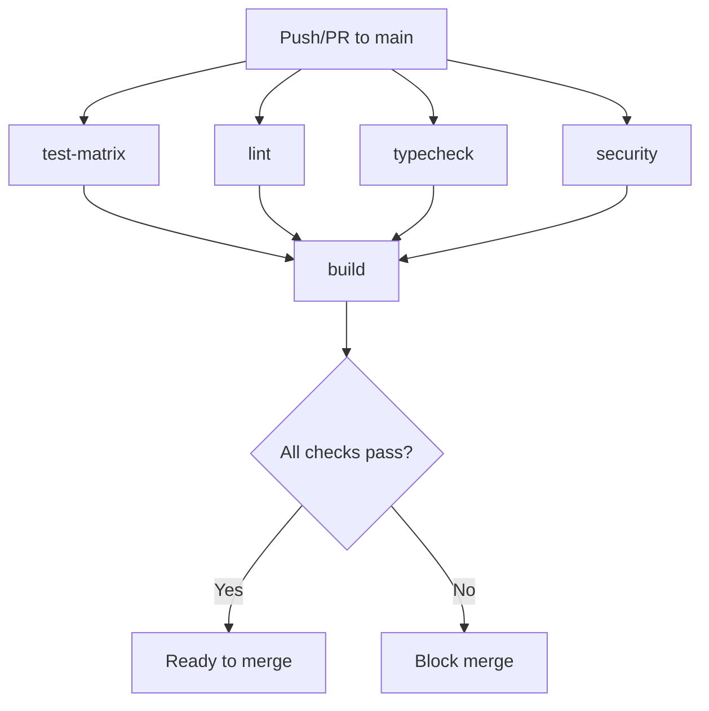
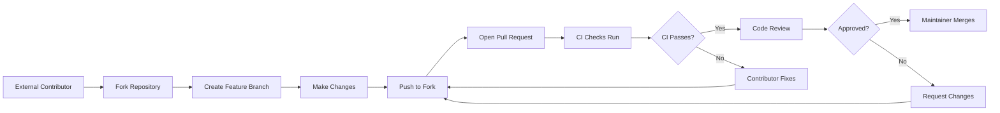

# GitHub Rulesets Configuration for OpenSourceFramework

This document provides comprehensive GitHub rulesets configuration for the OpenSourceFramework monorepo, designed to enforce open-source best practices and secure development workflows.

## Table of Contents

- [Overview](#overview)
- [Current CI Infrastructure](#current-ci-infrastructure)
- [CODEOWNERS Configuration](#codeowners-configuration)
- [GitHub Rulesets](#github-rulesets)
  - [Main Branch Protection Ruleset](#main-branch-protection-ruleset)
  - [Release Tag Protection Ruleset](#release-tag-protection-ruleset)
  - [Security-Sensitive Paths Ruleset](#security-sensitive-paths-ruleset)
- [Implementation Guide](#implementation-guide)
- [Open-Source Workflow Considerations](#open-source-workflow-considerations)
- [API Payloads for Automation](#api-payloads-for-automation)

---

## Overview

The OpenSourceFramework monorepo contains 7 npm packages under the `@opensourceframework/` scope:

| Package | Type | Security Considerations |
|---------|------|------------------------|
| `next-csrf` | Security-critical | Requires enhanced review |
| `next-images` | Standard | Normal review process |
| `critters` | Standard | Normal review process |
| `next-json-ld` | Standard | Normal review process |
| `next-circuit-breaker` | Standard | Normal review process |
| `react-a11y-utils` | Standard | Normal review process |
| `seeded-rng` | Security-relevant | Requires security review |

### Goals

1. **Protect main branch** from direct pushes and force pushes
2. **Ensure CI passes** before merging
3. **Require proper reviews** with code ownership enforcement
4. **Protect release tags** from deletion or modification
5. **Enable secure external contributions** via fork-based workflow

---

## Current CI Infrastructure

Based on the existing [`.github/workflows/ci.yml`](../.github/workflows/ci.yml), the following status checks are available:

### Required Status Checks

| Check Name | Job ID | Purpose |
|------------|--------|---------|
| `test-matrix` | Test across Node 18, 20, 22 on Ubuntu, Windows, macOS | Cross-platform compatibility |
| `lint` | ESLint validation | Code style enforcement |
| `typecheck` | TypeScript compilation | Type safety |
| `build` | Production build | Build verification |
| `security` | Security audit with Snyk | Vulnerability detection |

### CI Workflow Graph



---

## CODEOWNERS Configuration

Create a `.github/CODEOWNERS` file to define code ownership:

```github
# CODEOWNERS - OpenSourceFramework Monorepo
# https://docs.github.com/en/repositories/managing-your-repositorys-settings-and-features/customizing-your-repository/about-code-owners

# Default owners for everything in the repo
* @dario

# Repository configuration and tooling
/.github/ @dario
/.husky/ @dario
/tools/ @dario
/package.json @dario
/pnpm-lock.yaml @dario
/pnpm-workspace.yaml @dario
/tsconfig.json @dario
/turbo.json @dario
/eslint.config.js @dario

# Security-critical files - require maintainer review
/SECURITY.md @dario
/.github/SECURITY.md @dario
/.github/workflows/security-audit.yml @dario
/.github/workflows/release.yml @dario

# Changeset configuration
/.changeset/ @dario

# Security-critical packages - require enhanced review
/packages/next-csrf/ @dario
/packages/seeded-rng/ @dario

# Standard packages
/packages/next-images/ @dario
/packages/critters/ @dario
/packages/next-json-ld/ @dario
/packages/next-circuit-breaker/ @dario
/packages/react-a11y-utils/ @dario

# Documentation
/README.md @dario
/CONTRIBUTING.md @dario
/CONTRIBUTING_LADDER.md @dario
/CODE_OF_CONDUCT.md @dario
/PUBLISHING.md @dario
/LICENSE @dario
```

### CODEOWNERS Rules Explanation

| Pattern | Owners | Rationale |
|---------|--------|-----------|
| `*` | @dario | Default fallback for all files |
| `/packages/next-csrf/` | @dario | Security-critical CSRF package |
| `/packages/seeded-rng/` | @dario | Cryptographic RNG implementation |
| `/.github/workflows/` | @dario | CI/CD pipeline changes |
| `/.changeset/` | @dario | Version and release management |

---

## GitHub Rulesets

GitHub Rulesets provide a more powerful and flexible way to manage branch protection rules compared to traditional branch protection settings. They support:

- **Layered enforcement** - Multiple rulesets can apply to the same branches
- **Bypass permissions** - Define who can bypass rules
- **Repository targeting** - Apply rules at organization or repository level
- **Metadata restrictions** - Control commit message formats, etc.

### Main Branch Protection Ruleset

**Ruleset Name:** `main-branch-protection`

**Target:** Branch name pattern `main`

#### Rules Configuration

| Rule | Setting | Rationale |
|------|---------|-----------|
| **Restrict deletions** | ✅ Enabled | Prevent accidental branch deletion |
| **Require linear history** | ✅ Enabled | Clean git history, no merge commits |
| **Require signed commits** | ✅ Enabled | Verify commit authenticity |
| **Block force pushes** | ✅ Enabled | Prevent history rewriting |

#### Pull Request Rules

| Rule | Setting | Rationale |
|------|---------|-----------|
| **Require a pull request before merging** | ✅ Enabled | All changes via PR |
| **Required approving review count** | 1 | Minimum one approval |
| **Dismiss stale pull request approvals** | ✅ Enabled | Re-approve after updates |
| **Require review from Code Owners** | ✅ Enabled | Enforce CODEOWNERS |
| **Require conversation resolution** | ✅ Enabled | All discussions resolved |
| **Require last push approval** | ❌ Disabled | Would block maintainer workflow |

#### Required Status Checks

| Check | Required | Rationale |
|-------|----------|-----------|
| `lint` | ✅ | Code style compliance |
| `typecheck` | ✅ | TypeScript compilation |
| `build` | ✅ | Build verification |
| `test-matrix (Node 18, ubuntu-latest)` | ✅ | Minimum test coverage |
| `test-matrix (Node 20, ubuntu-latest)` | ✅ | LTS version test |
| `test-matrix (Node 22, ubuntu-latest)` | ✅ | Latest version test |

**Note:** We require only Ubuntu tests as mandatory to reduce CI latency. Windows and macOS tests are informational.

#### Bypass Permissions

| Actor | Bypass | Rationale |
|-------|--------|-----------|
| Repository Admin | ✅ | Emergency fixes |
| Maintainers | ❌ | Must follow standard process |
| Organization Owners | ✅ | Organization-level override |

### Release Tag Protection Ruleset

**Ruleset Name:** `release-tag-protection`

**Target:** Tag name pattern `v*`

#### Rules Configuration

| Rule | Setting | Rationale |
|------|---------|-----------|
| **Restrict deletions** | ✅ Enabled | Preserve release history |
| **Restrict updates** | ✅ Enabled | Immutable releases |
| **Block force pushes** | ✅ Enabled | No tag overwriting |

#### Allowed Actors for Tag Creation

| Actor | Allowed | Rationale |
|-------|---------|-----------|
| Repository Admin | ✅ | Release manager |
| Maintainers | ✅ | Via release workflow |
| GitHub Actions | ✅ | Automated releases |

### Security-Sensitive Paths Ruleset

**Ruleset Name:** `security-paths-protection`

**Target:** All branches (applied via path patterns)

This ruleset adds additional requirements for changes to security-sensitive files.

#### Path Patterns

```
packages/next-csrf/**
packages/seeded-rng/**
.github/workflows/security-audit.yml
SECURITY.md
```

#### Additional Rules

| Rule | Setting | Rationale |
|------|---------|-----------|
| **Require a pull request before merging** | ✅ Enabled | No direct commits |
| **Required approving review count** | 2 | Extra review for security |
| **Require review from Code Owners** | ✅ Enabled | Security package owners |

---

## Implementation Guide

### Step 1: Create CODEOWNERS File

Navigate to `.github/CODEOWNERS` and create the file with the content provided above.

### Step 2: Create Rulesets via GitHub UI

#### Main Branch Protection Ruleset

1. Go to **Settings** → **Rules** → **Rulesets** → **New ruleset** → **New branch ruleset**
2. Configure:
   - **Name:** `main-branch-protection`
   - **Enforcement status:** Active
   - **Target branches:** Add pattern `main`
3. Under **Branch rules**, enable:
   - ✅ Restrict deletions
   - ✅ Require linear history
   - ✅ Require signed commits
   - ✅ Block force pushes
4. Under **Pull request rules**, enable:
   - ✅ Require a pull request before merging
     - Required approvals: 1
     - ✅ Dismiss stale pull request approvals when new commits are pushed
     - ✅ Require review from Code Owners
   - ✅ Require conversation resolution before merging
5. Under **Required status checks**, add:
   - `lint`
   - `typecheck`
   - `build`
   - `test-matrix (Node 18, ubuntu-latest)`
   - `test-matrix (Node 20, ubuntu-latest)`
   - `test-matrix (Node 22, ubuntu-latest)`
6. Under **Bypass permissions**, add:
   - Repository Admin: Bypass
   - Organization Owners: Bypass
7. Click **Create**

#### Release Tag Protection Ruleset

1. Go to **Settings** → **Rules** → **Rulesets** → **New ruleset** → **New tag ruleset**
2. Configure:
   - **Name:** `release-tag-protection`
   - **Enforcement status:** Active
   - **Target tags:** Add pattern `v*`
3. Under **Tag rules**, enable:
   - ✅ Restrict deletions
   - ✅ Restrict updates
4. Click **Create**

### Step 3: Enable Commit Signing

Ensure all maintainers have commit signing configured:

1. Generate a GPG key or use SSH signing
2. Add the public key to GitHub account settings
3. Configure Git locally:
   ```bash
   # For GPG signing
   git config --global commit.gpgsign true
   git config --global gpg.program gpg
   
   # For SSH signing (newer method)
   git config --global commit.gpgsign true
   git config --global gpg.format ssh
   git config --global user.signingkey ~/.ssh/id_ed25519.pub
   ```

### Step 4: Configure Branch Protection (Legacy Method)

If not using Rulesets, traditional branch protection can be configured:

1. Go to **Settings** → **Branches** → **Add branch protection rule**
2. Branch name pattern: `main`
3. Enable:
   - ✅ Require a pull request before merging
   - ✅ Require status checks to pass before merging
   - ✅ Require conversation resolution before merging
   - ✅ Require signed commits
   - ✅ Require linear history
   - ✅ Include administrators

---

## Open-Source Workflow Considerations

### External Contributor Workflow



### Handling External Contributions

| Scenario | Handling |
|----------|----------|
| First-time contributor | Welcome message, guide through process |
| CI failures | Automated comment with failure details |
| Missing changeset | Bot reminder to add changeset |
| Security-sensitive changes | Additional review required |

### Maintainer Merge Workflow

1. **Verify CI passes** - All status checks green
2. **Review approval present** - At least one approval
3. **CODEOWNERS satisfied** - Required reviews completed
4. **Conversations resolved** - All discussions addressed
5. **Squash and merge** - Clean commit history

### Recommended Merge Strategy

| Setting | Value | Rationale |
|---------|-------|-----------|
| Merge method | Squash and merge | Clean history |
| Commit message | Use PR title | Conventional commits |
| Delete branch | After merge | Cleanup |

---

## API Payloads for Automation

For programmatic configuration, use the GitHub REST API:

### Create Main Branch Ruleset

```json
{
  "name": "main-branch-protection",
  "target": "branch",
  "enforcement": "active",
  "conditions": {
    "ref_name": {
      "include": ["refs/heads/main"],
      "exclude": []
    }
  },
  "rules": [
    {
      "type": "deletion"
    },
    {
      "type": "non_fast_forward"
    },
    {
      "type": "pull_request",
      "parameters": {
        "required_approving_review_count": 1,
        "dismiss_stale_reviews_on_push": true,
        "require_code_owner_review": true,
        "require_last_push_approval": false,
        "required_linear_history": true,
        "allowed_merge_methods": ["squash"]
      }
    },
    {
      "type": "required_status_checks",
      "parameters": {
        "strict_required_status_checks_policy": false,
        "required_status_checks": [
          { "context": "lint" },
          { "context": "typecheck" },
          { "context": "build" },
          { "context": "test-matrix (Node 18, ubuntu-latest)" },
          { "context": "test-matrix (Node 20, ubuntu-latest)" },
          { "context": "test-matrix (Node 22, ubuntu-latest)" }
        ]
      }
    },
    {
      "type": "required_signatures"
    }
  ],
  "bypass_actors": [
    {
      "actor_id": 1,
      "actor_type": "RepositoryAdmin",
      "bypass_mode": "always"
    },
    {
      "actor_id": 2,
      "actor_type": "OrganizationAdmin",
      "bypass_mode": "always"
    }
  ]
}
```

### Create Tag Protection Ruleset

```json
{
  "name": "release-tag-protection",
  "target": "tag",
  "enforcement": "active",
  "conditions": {
    "ref_name": {
      "include": ["refs/tags/v*"],
      "exclude": []
    }
  },
  "rules": [
    {
      "type": "deletion"
    },
    {
      "type": "non_fast_forward"
    },
    {
      "type": "update"
    }
  ]
}
```

### GitHub CLI Commands

```bash
# Create ruleset using GitHub CLI
gh api repos/{owner}/{repo}/rulesets \
  -f name='main-branch-protection' \
  -f target='branch' \
  -f enforcement='active' \
  -F conditions='{"ref_name":{"include":["refs/heads/main"],"exclude":[]}}' \
  -F rules='[{"type":"deletion"},{"type":"non_fast_forward"},{"type":"required_signatures"}]'

# List existing rulesets
gh api repos/{owner}/{repo}/rulesets

# Get ruleset details
gh api repos/{owner}/{repo}/rulesets/{ruleset_id}
```

---

## Summary Checklist

### Files to Create

- [ ] `.github/CODEOWNERS` - Code ownership definitions

### Rulesets to Configure

- [ ] `main-branch-protection` - Main branch ruleset
- [ ] `release-tag-protection` - Release tag ruleset

### Settings to Enable

- [ ] Require signed commits
- [ ] Require linear history
- [ ] Block force pushes
- [ ] Restrict branch deletions
- [ ] Require PR reviews
- [ ] Require CODEOWNERS review
- [ ] Require status checks

### External Contributions

- [ ] Fork-based workflow documented
- [ ] PR template updated
- [ ] CI provides clear feedback
- [ ] Maintainer merge guidelines defined

---

## References

- [GitHub Rulesets Documentation](https://docs.github.com/en/repositories/configuring-branches-and-merges-in-your-repository/managing-rulesets/about-rulesets)
- [CODEOWNERS Syntax](https://docs.github.com/en/repositories/managing-your-repositorys-settings-and-features/customizing-your-repository/about-code-owners)
- [Branch Protection Rules](https://docs.github.com/en/repositories/configuring-branches-and-merges-in-your-repository/defining-the-mergeability-of-pull-requests/about-protected-branches)
- [Commit Signing](https://docs.github.com/en/authentication/managing-commit-signature-verification/signing-commits)

---

**Last Updated:** February 2026
